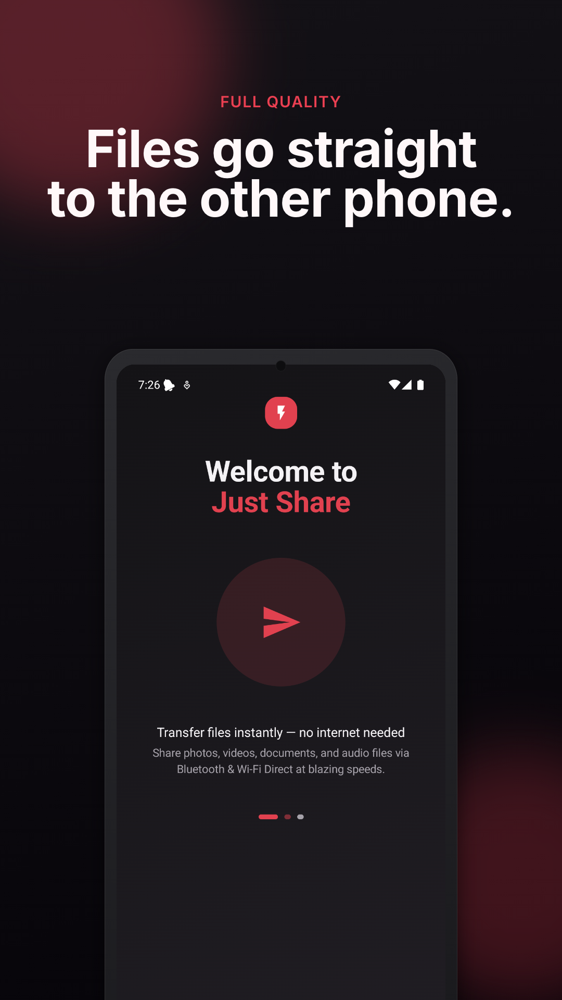
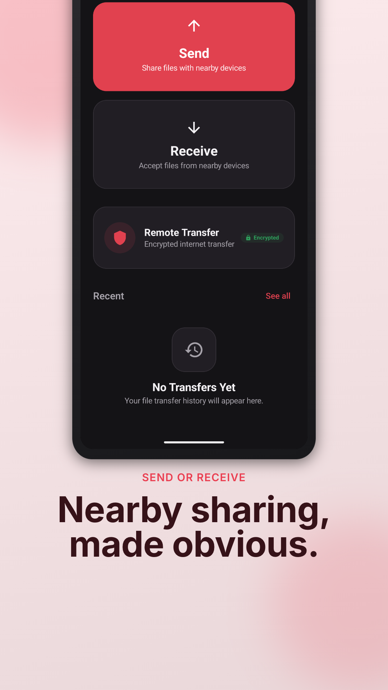
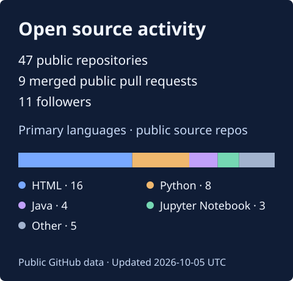

# Sai Dheeraj Peketi

**Technical Analyst at Oracle · OCI Compute**

I work across cloud infrastructure, distributed systems, and automation. My projects span Android apps, AI / ML, and quantitative trading tools.

**[Portfolio](https://developer.blackandblue.co.in/)** · [LinkedIn](https://linkedin.com/in/peketisaidheeraj) · [LeetCode](https://leetcode.com/sai_dheeraj_peketi) · [Email](mailto:saidheerajpeketi@gmail.com)

---

## Built to be useful

### [Just-Share](https://github.com/SaiDheerajPeketi/Just-Share)
Peer-to-peer file sharing for Android. **Kotlin**

  
  

**[Explore the source](https://github.com/SaiDheerajPeketi/Just-Share)**

## Systems, research & everyday tools

### [Algo Options](https://github.com/SaiDheerajPeketi/Algo_Options)
Algorithmic options trading strategies and analysis. **Python**

### [Stock Trading Notifier](https://github.com/SaiDheerajPeketi/Automated_Stock_Trading_Notifier)
Automated stock signal detection and alerts. **Python · Jupyter**

### [FlowSpace](https://flowspace.blackandblue.co.in/)
Android launcher, focus timer, app limits, and device automation. **Android** · [Public app information](https://flowspace.blackandblue.co.in/)

<strong>More projects: cloud deployments and web interfaces</strong>

- [OCI DevOps CI/CD](https://github.com/SaiDheerajPeketi/oci-arch-devops-cicd-with-functions) — Oracle Cloud pipelines with serverless functions. **Terraform · HCL**
- [OCI Helm Node Service](https://github.com/SaiDheerajPeketi/oci-helm-node-service) — Node.js deployment to OKE using Helm charts. **JavaScript · Helm**
- [TBS TV Clone](https://github.com/SaiDheerajPeketi/TBS-TV-Clone) — Streaming platform interface. **JavaScript**

## What I work with

| Area | Tools and interests |
| :--- | :--- |
| Cloud & systems | OCI Compute, distributed systems, microservices, REST APIs |
| Infrastructure & delivery | Docker, Kubernetes, Terraform, Helm, Nginx, GitHub Actions |
| Software | Python, Kotlin, Java, Rust, C / C++, JavaScript, TypeScript, Shell |
| AI & data | PyTorch, TensorFlow, scikit-learn, computer vision, NLP, data pipelines |
| Quantitative research | Options strategies, backtesting, automated signals |
| Storage | PostgreSQL, MySQL, SQLite, Redis |

<strong>Full toolkit and other interests</strong>

- **Machine learning:** Keras, Pandas, NumPy, OpenCV, Jupyter, Hugging Face; model training and evaluation.
- **Web & configuration:** HTML, CSS, YAML.
- **Engineering:** System design, CI/CD, infrastructure as code, container orchestration, ETL, analysis, and visualization.
- **Blockchain:** Hyperledger Fabric, smart contracts, distributed ledgers.
- **Embedded & IoT:** Raspberry Pi, Arduino, low-level systems programming.
- **Developer tools:** Git, Linux, Postman, Gradle, VS Code.
- **Platforms:** Ubuntu, Pop!_OS, macOS, Windows.

## A little more about me

- **Education:** B.Tech in Computer Science, MNNIT Allahabad · CPI **9.09 / 10**.
- **Based in:** India.
- **Working principle:** “Automate everything you do more than twice.”

## Open source activity

<picture>
  <source media="(max-width: 600px)" srcset="assets/activity-mobile.svg">
  
</picture>

Generated daily from public GitHub data. [View recent contributions](https://github.com/SaiDheerajPeketi#js-contribution-activity-description).

## Explore & connect

[Browse my repositories](https://github.com/SaiDheerajPeketi?tab=repositories) · [GitHub activity](https://github.com/SaiDheerajPeketi#js-contribution-activity-description) · [Achievements](https://github.com/SaiDheerajPeketi?tab=achievements)

For more about my work, visit **[developer.blackandblue.co.in](https://developer.blackandblue.co.in/)** or reach me at **[saidheerajpeketi@gmail.com](mailto:saidheerajpeketi@gmail.com)**.
